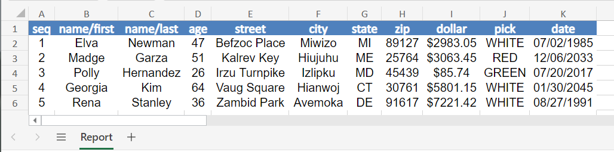

# Convert CSV to XLSX

A JSON-based tool for converting your automated CSV reports into a customized Excel XLSX file.

## Prerequisites

| Property | Value                                                        |
|-|--------------------------------------------------------------|
| Python | This has been tested in Python 3.12 (64-bit).                |
| Python Modules | Please see [requirements.txt](requirements.txt) for details. | 

## Usage

1. Refer to [config.json](config.json) to customize the styling of the XLSX. 
2. Run `python main.py -h` or `python main.py --help` to see the required parameters.

```bash
options:
  -h, --help            show this help message and exit
  -f CSV, --file CSV    CSV file
  -c CONFIG, --config CONFIG
                        JSON Configuration file
```

### Output

A successful prompt will appear in the console and an XLSX file having the basename of your CSV input. 

```
The file 'config.json' exists.
CSV file 'test.csv' successfully converted to XLSX file 'test.xlsx'
```



## References

- [OpenPyXL](https://openpyxl.readthedocs.io/en/stable/styles.html): Working with styles
- [StackOverflow](https://stackoverflow.com/questions/12976378/openpyxl-convert-csv-to-excel): openpyxl convert CSV to EXCEL
- [Tongere](https://tongere.hashnode.dev/openpyxl-working-with-csv-files): OpenPyXL - Working with CSV Files